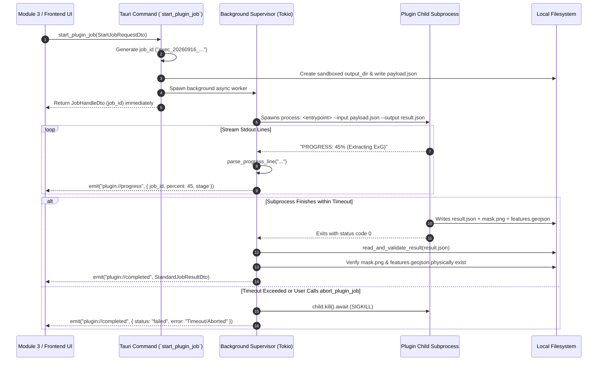

# Domain 3: Async Execution, Progress & Output Resolution (Rust Core)
> **Module 2: Plugin Architecture & Extension Manager**  
> **Parent Guide**: [README.md](README.md)

---

## 1. Domain Purpose & Overview

Domain 3 is the execution engine of Module 2. It supervises asynchronous child subprocesses, streams real-time stdout progress to the frontend, enforces timeouts, handles user aborts, and validates the resulting analytical outputs (both scalar metrics and file artifacts).

---

## 2. Function Specification Matrix

| Function Name | Scope | Input Parameters | Output Type | Purity / Category | Pre-condition | Post-condition | Description |
| :--- | :--- | :--- | :--- | :--- | :--- | :--- | :--- |
| **`start_plugin_job`** | `pub (IPC Tauri)` | `request: StartJobRequestDto, state: State<'_, AppState>` | `Result<JobHandleDto, String>` | **Async Subprocess Spawn** | Plugin exists and is `enabled`. Source image path exists. | Generates unique `job_id`, creates workspace, writes `payload.json`, spawns background process, and registers job in active tracker. Non-blocking. | Initiates asynchronous plugin analysis on a single image, pair, or AOI. |
| **`abort_plugin_job`** | `pub (IPC Tauri)` | `job_id: String, state: State<'_, AppState>` | `Result<(), String>` | **OS Signal (Kill Process)** | `job_id` matches an active running job. | Child process killed immediately; temporary partial files cleaned up; job marked as `Aborted`. | Forcibly terminates an in-flight plugin job upon user cancellation. |
| **`get_job_status`** | `pub (IPC Tauri)` | `job_id: String, state: State<'_, AppState>` | `Result<JobStatusDto, String>` | **I/O (Read Memory State)** | `job_id` exists in tracker. | Returns current lifecycle state (`Queued`, `Running`, `Completed`, `Failed`, `Aborted`) and progress percentage. | Polled by UI when navigating between pages or re-attaching to ongoing jobs. |
| **`get_job_result`** | `pub (IPC Tauri)` | `job_id: String, state: State<'_, AppState>` | `Result<StandardJobResultDto, String>` | **I/O (Read Memory / Disk)** | Job is in `Completed` state. | Returns complete validated metrics and artifact descriptors with georeferenced bounds. | Delivers full analytical outputs to Modules 3, 5, 6, 7, 9, 10, and 11. |
| **`build_execution_payload`**| `pub(crate)` | `job_id: &str, output_dir: &Path, req: &StartJobRequestDto` | `Result<ExecutionPayload, PluginError>` | **Pure Function** | Parameters conform to `parameters.json`. | Generates in-memory JSON payload matching `execution_payload.schema.json`. | Pure constructor for the plugin input payload. |
| **`parse_progress_line`** | `pub(crate)` | `line: &str` | `Option<JobProgress>` | **Pure Function** | Single line from plugin stdout. | Returns structured progress (`percent`, `stage`) if line matches progress token; otherwise `None`. | Extracts real-time progress percentages without crashing on regular log text. |
| **`read_and_validate_result`**| `pub(crate)` | `result_path: &Path, output_dir: &Path, spec: &OutputsSpec` | `Result<StandardJobResultDto, PluginError>` | **I/O (Read FS) + Pure Validation**| `--output` file exists and is valid JSON. | Result conforms to `execution_result.schema.json`; declared artifact files are verified on disk. | Ingests output JSON, validates metrics, and verifies generated files. |
| **`resolve_executable`** | `pub(crate)` | `plugin_dir: &Path, runtime: &RuntimeDef` | `Result<tokio::process::Command, PluginError>` | **I/O (Check Executable & Permissions)** | Target script or binary exists in plugin folder. | Returns configured command with `--input` and `--output` flags attached. | Prepares cross-platform process command (virtualenv Python or native binary). |

---

## 3. Execution Data Models & DTOs

```rust
use serde::{Deserialize, Serialize};
use std::collections::HashMap;

/// Analysis request delivered by Frontend or Modules 1 & 3
#[derive(Debug, Clone, Serialize, Deserialize)]
pub struct StartJobRequestDto {
    pub plugin_id: String,
    pub session_id: Option<String>,
    pub target_image_path: String,
    pub mime_type: String,
    pub aoi: Option<serde_json::Value>, // GeoJSON Polygon or Bounding Box
    pub parameters: HashMap<String, serde_json::Value>,
}

/// Instant return handle from `start_plugin_job`
#[derive(Debug, Clone, Serialize, Deserialize)]
pub struct JobHandleDto {
    pub job_id: String,
    pub plugin_id: String,
    pub status: String, // "queued" | "running"
}

/// Dynamic Progress Event emitted over Tauri IPC (`app.emit("plugin://progress", ...)`)
#[derive(Debug, Clone, Serialize, Deserialize)]
pub struct JobProgress {
    pub job_id: String,
    pub percent: u8,   // 0 to 100
    pub stage: String, // e.g. "preprocessing", "evaluating_index", "saving_mask"
}

/// Job Status for polling and UI state recovery
#[derive(Debug, Clone, Serialize, Deserialize)]
#[serde(tag = "state", content = "data")]
pub enum JobStatusDto {
    Queued,
    Running { progress_pct: u8, stage: String },
    Completed { execution_time_ms: u64 },
    Failed { error: String },
    Aborted,
}

/// Unified Result deliverable for downstream modules (Modules 3, 5, 6, 7, 9, 10, 11)
#[derive(Debug, Clone, Serialize, Deserialize)]
pub struct StandardJobResultDto {
    pub job_id: String,
    pub execution_time_ms: u64,
    pub status: String, // "success" | "warning" | "failure"
    /// Scalar Metrics for Modules 5, 7, 9, 11 (e.g. coverage_pct: 68.4, tree_count: 87)
    pub metrics: HashMap<String, serde_json::Value>,
    /// Physical Artifacts with verified paths and layer visualization hints for Module 3
    pub artifacts: HashMap<String, VerifiedArtifactDto>,
    pub error: Option<String>,
}

#[derive(Debug, Clone, Serialize, Deserialize)]
pub struct VerifiedArtifactDto {
    pub file_path: String,       // Absolute verified path on physical disk
    pub format: String,          // "image/png", "application/geo+json", "image/tiff"
    pub bounds: Option<Vec<f64>>,// [min_lon, min_lat, max_lon, max_lat] for GIS projections
}
```

---

## 4. End-to-End Execution Sequence Flow



---

## 5. Subprocess Execution & Isolation Protocols

### 5.1 The CLI Contract
Plugins are executed directly without shell wrappers:
```bash
<plugin_entrypoint> --input <path_to_payload.json> --output <path_to_result.json>
```

### 5.2 Stdout vs Output Ingestion Protocol
> [!IMPORTANT]
> Plugins write their final output to the file path specified by `--output`. `stdout` is streamed line-by-line solely for progress updates and logs.

```rust
pub fn parse_progress_line(line: &str) -> Option<JobProgress> {
    let trimmed = line.trim();
    if let Some(json_slice) = trimmed.strip_prefix("PROGRESS:") {
        serde_json::from_str::<JobProgress>(json_slice.trim()).ok()
    } else {
        None
    }
}
```

### 5.3 Timeout Enforcement & Process Tree Termination
Subprocess execution is wrapped in a strict timeout. If the deadline expires, the process is killed to prevent runaway computation:

```rust
use std::time::Duration;
use tokio::time::timeout;

pub async fn supervise_execution(
    mut child: tokio::process::Child,
    timeout_secs: u64,
) -> Result<std::process::ExitStatus, PluginError> {
    match timeout(Duration::from_secs(timeout_secs), child.wait()).await {
        Ok(Ok(status)) => Ok(status),
        Ok(Err(e)) => Err(PluginError::Io(e.to_string())),
        Err(_) => {
            // Force kill to prevent orphaned background processes
            let _ = child.kill().await;
            Err(PluginError::Timeout(timeout_secs))
        }
    }
}
```
